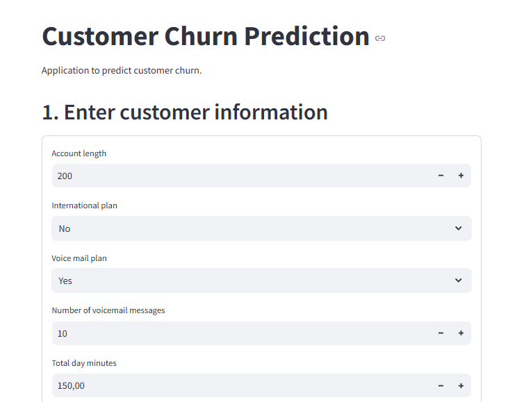

# Customer Churn Prediction with PySpark

## Overview
This project leverages Apache Spark and PySpark to predict customer churn for a telecommunications company. By utilizing big data processing, the solution efficiently analyzes large datasets and applies machine learning models to identify customers at risk of leaving, enabling proactive retention strategies.

## Motivation
Organizations dealing with big data require scalable distributed systems. Apache Spark is a leading solution, offering speed and simplicity for processing petabytes of data. This repository demonstrates practical PySpark applications for ETL, data modeling, and machine learning, making it a valuable resource for data professionals and analysts.

## Project Structure
- `data/`: Datasets for training and evaluation
- `notebooks/`: Jupyter notebooks for analysis and modeling
- `model/`: Saved models and related artifacts
- `images/`: Visualizations and figures
- `report/`: Project report
  
## Dataset
The dataset contains 20 columns with a mix of continuous, discrete, and categorical features. Key attributes include International plan, Total day charge, and Customer service calls, which are strong predictors of churn. The target variable is 'Churn', indicating whether a customer discontinued the service. Data files are located in the `data/` directory.

## Installation
1. **Clone the repository**
   ```powershell
   git clone https://github.com/ttdat1712/BigData_Churn-Prediction-with-PySpark.git
   cd BigData_Churn-Prediction-with-PySpark
   ```
2. **Install Python (>=3.7)**
3. **Install dependencies**
   ```powershell
   pip install pyspark notebook
   ```
4. **(Optional) Create a virtual environment**
   ```powershell
   python -m venv venv
   .\venv\Scripts\activate
   pip install pyspark 
   ```
   
## Usage
1. **Start Jupyter Notebook**
   ```powershell
   jupyter notebook
   ```
2. **Open and run the notebook**
   - Navigate to `notebooks/ProjectBigData_CustomerChurnPrediction.ipynb`.
   - Follow the steps to preprocess data, train the model, and evaluate results.
3. **Model Training & Evaluation**
   - Data preprocessing: Handle missing values, encode categorical features
   - Model training: Decision Tree, Random Forest, or other algorithms
   - Evaluation: Accuracy, Precision, Recall, F1-score
4. **View Results**
   - Visualizations and metrics are available in the notebook and `images/` directory
   - Detailed report in `report/report.pdf`

## Results
The project demonstrates effective churn prediction using PySpark. Key results include:
- **Model Performance:** Achieved high accuracy and F1-score on test data
- **Feature Importance:** International plan, Total day charge, and Customer service calls are top predictors
- **Visualizations:** Confusion matrix, ROC curve, and feature importance plots (see `images/`)
- **Report:** Detailed analysis and findings in [report/report.pdf](report/report.pdf)

## Future Work
- Fine-tune hyperparameters
- Experiment with additional algorithms
- Implement real-time monitoring for early churn detection
  
## Resources
[Report](report/report.pdf)

[View PowerPoint Presentation](https://www.canva.com/design/DAGYYjXLDq8/eWAaYeecaHkId6K_gUjoeQ/edit)

[Source Code](notebooks/ProjectBigData_CustomerChurnPrediction.ipynb)
